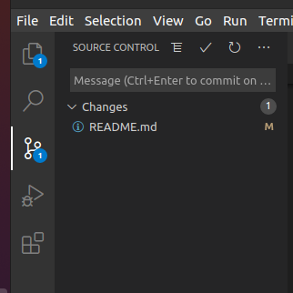
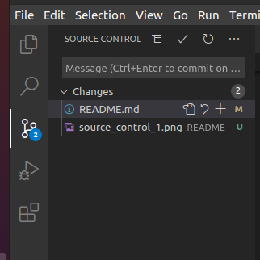
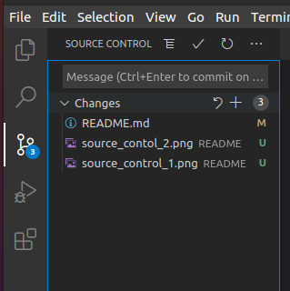
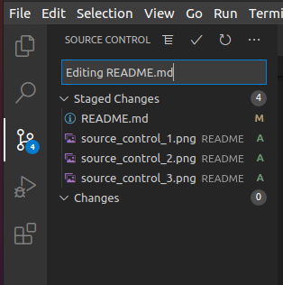
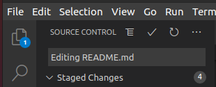
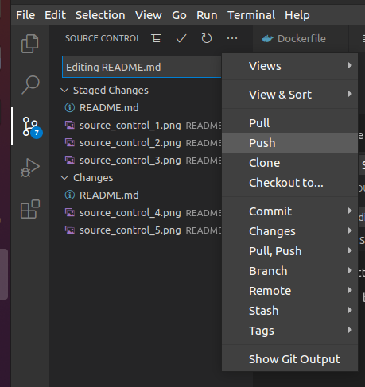

# Group 24 Project
## Initial Setup
### Creating the image
This command will build the docker image, and then run it in a container, and a rails server will be hosted on localhost:3000:
```bash
docker-compose up --build 
```
### Running bash on rails container
After the command finishes running open other terminal window and run the following command to open bash inside the container:
```bash
docker exec -it web-cw-group-24-calendar_primary_1 /bin/bash -il
```
### Accessing the database from inside the rails container
To access the database from the rails container you must first access the rails container using [this](#running-bash) command, then type:
```bash
rails db
```
The password is currently: "group24"

## Using the Authentication Microservice

The Authentication Microservice is run inside a docker container that is booted up by using [this](#creating-the-image) command.

### The topbar

The topbar that is available on every page will handle and deal with logging in, logging out and signing up.

### Helper Methods

There are a few Helper Methods that in the ApplicationController.rb file. 

#### login_http

login_http(loginParams) is a method that sends a http request to the auth microservice that will log the user in provided their credintials are correct.

The method will populate several session variables:

session[:user_id] is a session variable that will store the current users id that is used to access the database this refers to a users "auth_id" attribute, **not** the "id" attribute

session[:jwt_token] is a session variable that will store the current users JWT token.

session[:logged_in] is a session variable that will store a boolean that represents whether or not a user is logged in.

#### auth

auth is a method that will send the current users JWT token to the auth microservice to check that it is still valid, this method should be used to check if the current user should be able to access the database.

auth will set the session variable session[:logged_in] to false if the authentication microservice says that they user is not authenticated (either timed out or logged out else where).

#### sign_up_http

sign_up_http(sign_up_params) is a method that tries to sign up a new user provided that their credentials are not already in use.

session[:user_id], session[:jwt_token] and session[:logged_in] are all assigned by this method.

This method also creates a user in the main database and assigns it the auth_id from auth microservice.

#### log_out

log_out is a method that sends a delete http request containing the JWT token of the current user so that it can be added to the denylist table on the auth database. This table will be searched whenever the auth method is used to determine if the JWT token is still valid.

session[:logged_in] is set to false by this method

#### get_emails

get_emails is a method that takes as inputs an array of user_ids and retrives the email addresses of the corresponding users if the current user is authenticated

session[:logged_in] is set to false if the user is not autheticated by the auth microservice

## Mailer Microservice

The Mailer Microservice is run inside a docker container that is booted up by using [this](#creating-the-image) command.

### Helper Methods

There are a few Helper Methods that in the ApplicationController.rb file, which means the methods are available to any controller that inherits from ApplicationController (i.e most controllers).

#### reminder_email

reminder_email(emails, reminder) is a method that takes two inputs, emails and reminder, emails is a list of emails that the reminder needs to be sent to, and the reminder input is a reminder object (currently no model exists, need to implement when reminders are added to the database).

## Adding to the readme
When editing use this as a guide: https://guides.github.com/features/mastering-markdown/

When writing code please wrap in triple backticks ```` ``` ```` before and after. If writing code for bash use ```` ```bash your code here ``` ````

For example:
```bash
your code here
```
## Troubleshooting
### Database unknown
If you get the error:
```bash
database 'docker' unknown
```
you need to create the database, while using the mysql terminal use this command:
```bash
create database
```

### Linux troubleshoot
#### Files owned by root
If files end up owned by root the following should be run to make current user owner of all files
```bash
sudo chown -R $(whoami).users .
```
## Pushing files to git
Make changes to project and then save them.

### First time setup
Make sure that the following configurations are set:

```bash
git config --global user.name 

git config --global user.email
```
### Using VSCode
On the left side of VSCode go to source control, your changes will appear here:



Hover over the change and click the plus to stage changes (If you are working on two separate things and need to make a commit you should split the changes into multiple commits if you can): 



Alternatively hover over the changes bar and click the plus to stage all changes:



Then add a title for your changes (be descriptive):



Then click the tick at the top bar to commit:



Click on the triple dot and click on push:



### If your commit fails

If your commit fails you might need to pull the changes from commits that others have made. To do this you open the triple dot menu and click pull and then try push again.

